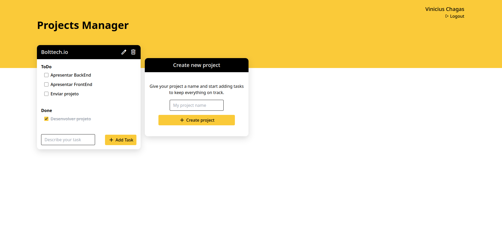

# PROJECT MANAGER

Este software foi desenvolvido com base em um desafio técnico, a fim de testar os conhecimentos técnicos e resolução de problemas dos candidatos.

O PROJECT MANAGER é um software de cadastro e gerenciamento de projetos e tarefas.

</br>

## Links Uteis

<li>Online Preview: <a href="https://frontend-project-manager.vercel.app/" target="_blank">Link</a></li>

</br>

## Instruções para uso

#### ATENÇÃO: Este projeto depende do seu BackEnd para funcionar corretamente!

Link do repositório do backend: <a href="https://github.com/ViniciusCChagas/be-project-manager" target="_blank">Clique aqui</a>

### 1. Clonar repositório

Você pode clonar esse repositório utilizando o comando: <br>

```bash
$ git clone https://github.com/ViniciusCChagas/fe-project-manager
```

ou você pode baixar o repositório como um arquivo .ZIP

### 2. Instalar as dependências

Após isso, na pasta do projeto rode o comando

```bash
$ npm install
#ou
$ yarn
```

para instalar todas as dependencias do projeto. <br>

### 3. Configurar as variaveis de ambiente

Depois de instalar todas as dependencias do projeto, devemos configurar as variaveis de ambiente:

Devemos criar um arquivo `.env` na raiz do projeto e então copiar o conteudo do arquivo `.env.example` para dentro, preenchendo os dados com as informações corretas.

```env
VITE_API_URL=<URL DO BACKEND>
```

### 4. Rodar a aplicação

Depois configurar as variaveis de ambiente, vamos executa-lo em modo de desenvolvimento, utilizando o comando:

```bash
$ npm run dev
# ou
$ yarn dev
```

Após isso podemos acessar o App no endereço: [http://localhost:5173](http://localhost:5173) e conferir o resultado.

</br>

## Algumas imagens do projeto

#### Tela de Login:


<br/>

#### Tela de cadastro:


<br/>

#### Tela de gerenciamento de projetos/tarefas:



<br/>

## Ferramentas utilizadas

<li>ReactJS</li>
<li>ReactQuery</li>
<li>ContextAPI</li>
<li>TypeScript</li>
<li>TailwindCSS</li>
<li>Vite</li>